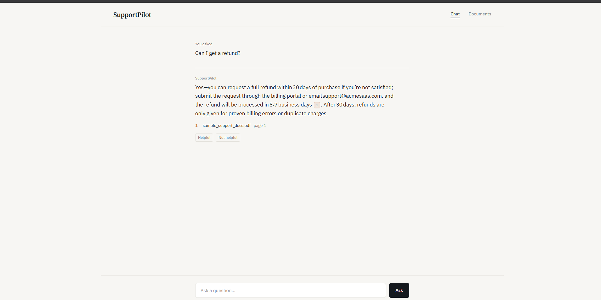
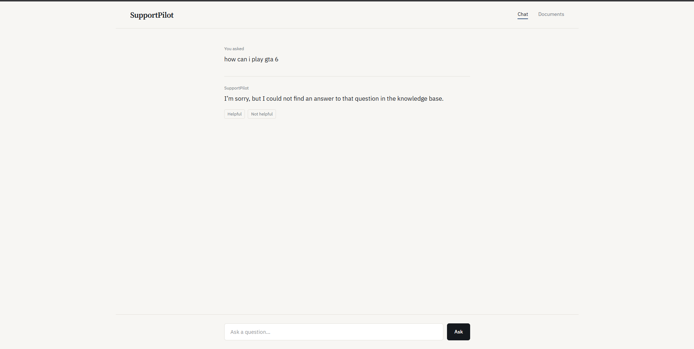
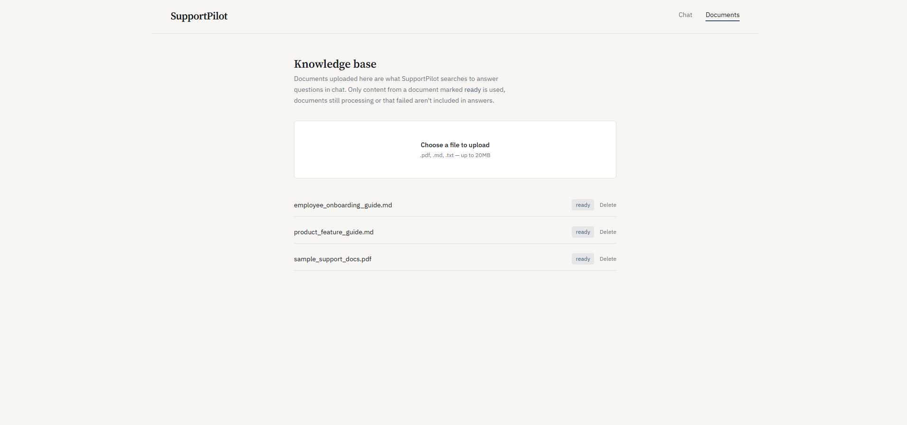

# SupportPilot

An AI support copilot that answers customer-support questions from a company's own documentation, grounded, cited, and honest about what it doesn't know.

**Live demo:** [https://ai-support-pilot.vercel.app/](#) ·

---

## Screenshots

<!-- Chat screen with a real answer and inline citations -->


<!-- Escalation / insufficient-evidence state -->


<!-- Document upload and status list -->


---

## What it does

- Upload PDF, Markdown, or TXT documents
- Ask questions in natural language, answers are generated **only** from retrieved document content
- Every claim is cited back to a specific document and page, citations are built from database metadata, never invented by the model
- When the knowledge base doesn't contain an answer, SupportPilot says so and recommends escalation, instead of guessing
- Follow-up questions are resolved against conversation history before retrieval runs
- Thumbs up / down feedback on every answer

## How it works

Documents → Chunking → Embeddings
↓
Question → Hybrid Search (vector + BM25) → Rerank → Evidence Check
↓
Grounded Generation → Citations


- **Retrieval**: FAISS vector search combined with BM25 keyword search, re-ranked with a cross-encoder
- **Evidence check**: a relevance-score threshold runs before generation, questions with no real supporting evidence never reach the LLM
- **Generation**: the model is instructed to answer only from retrieved context and to say when it can't find something
- **Citations**: the model only emits numeric markers (`[1]`, `[2]`); the actual source, document title, and page are resolved from the database, not from the model's text

## Measured results

Retrieval and generation quality were evaluated against a labeled question set, not assumed:

| Configuration | Recall@5 | Precision@5 | MRR |
|---|---|---|---|
| Vector search only | 100% | 0.49 | 0.97 |
| BM25 only | 94.1% | 0.48 | 0.80 |
| Hybrid + Rerank | **100%** | 0.55 | **1.00** |

Generation faithfulness (LLM-as-judge): ~82–88% across runs. Full methodology and findings in [`evaluation/EXPERIMENTS.md`](backend/evaluation/EXPERIMENTS.md).

## Stack

| | |
|---|---|
| Frontend | Next.js, TypeScript, Tailwind |
| Backend | FastAPI, SQLAlchemy, Alembic |
| Database | PostgreSQL (Neon) |
| Retrieval | FAISS, BM25 (rank-bm25), cross-encoder reranker |
| Embeddings | sentence-transformers (local dev) / Gemini Embedding API (production) |
| Generation | Ollama (local dev) / Groq (production) |
| Deployment | Render (backend), Vercel (frontend) |

Local development runs entirely free and offline, no API keys required. Production swaps in Groq and Gemini's free tiers to work within hosting memory limits, selected by environment variable, no code changes.

## Local setup

```bash
# Backend
cd backend
uv sync
cp .env.example .env   # fill in DATABASE_URL
uv run alembic upgrade head
uv run uvicorn app.main:app --reload

# Frontend
cd frontend
npm install
cp .env.local.example .env.local   # set NEXT_PUBLIC_API_URL
npm run dev
```

Requires PostgreSQL running locally and [Ollama](https://ollama.com) with a pulled model for local generation.

## Known limitations

- Citation correctness checking (does a cited chunk actually support the claim next to it) is implemented but not yet fully validated, see `EXPERIMENTS.md`
- Reranking is disabled in the current production deployment due to free-tier memory constraints; hybrid search scores are used for the evidence check instead
- Uploaded files on the deployed backend are not persisted across restarts (ephemeral disk on the free tier); processed chunks and embeddings in the database are unaffected

## What I'd improve next

- Move reranking to a hosted API once a verified free option is confirmed, to restore full retrieval quality in production
- Grow the evaluation set toward 50+ questions
- Add persistent object storage for uploaded files